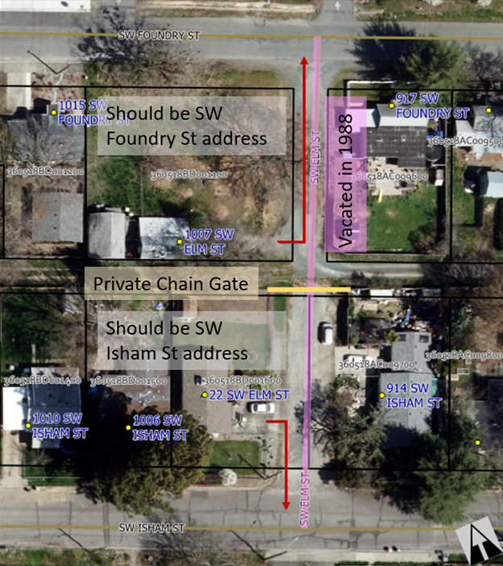

# Issue: Deprecated Street Names

Affected addresses:

- 22 & 1007 SW Elm St, 1580, 1600, 1628, 1630 & 1632 Willow Ln;
- 271 Fruitdale Dr, 271 Fruitdale Dr Unit D, 275 & 301 Fruitdale Dr;

Description: The City vacated SW Elm St in 1988, and yet two properties still have SW Elm St addresses, even though SW Elm St no longer exists (see Figure 1).
These addresses came to staff attention because of delays and confusion experienced during emergency response.
When SW Elm St was vacated, it was not removed from the City transportation map.
As a result, the CAD system routed emergency response vehicles through the former SW Elm St, who discovered it is now a gated private drive blocking access.
Existing SW Elm St addresses (22 and 1007 SW Elm St) need to be reassigned addresses using street names consistent with their primary access, defined as the first public street providing access to their private driveway.

The primary access to a property can change as development density increases.
Addresses that relied on a long private driveway to access a public road may find new access streets become available as a result of subdivisions created nearby.
In the case of 1630 Willow Ln, the creation of the Willow Glen Subdivision resulted in part of their private drive becoming Darin Dr, and now their primary access has changed from Willow Ln to Darin Dr, necessitating a change to a Darin Dr address.
Likewise, 1580 & 1600 Willow Ln previously took primary access from Willow Ln, but now take access from Esther Ln, and should receive Esther Ln addresses (see Figure 2).

The properties with Fruitdale Dr assignments take primary access from either Poplar Dr or Canal Ln.
